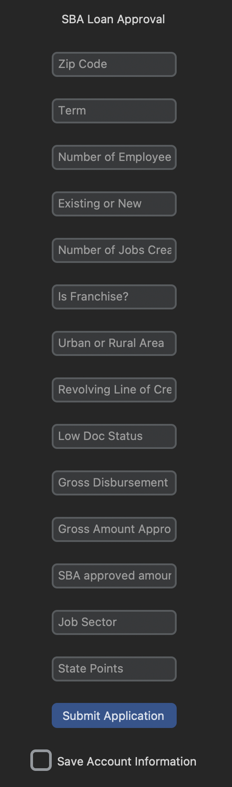
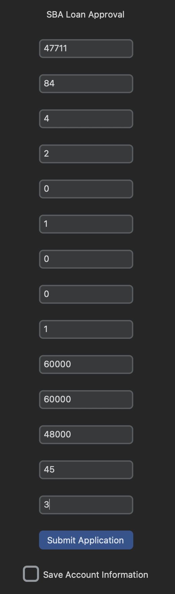
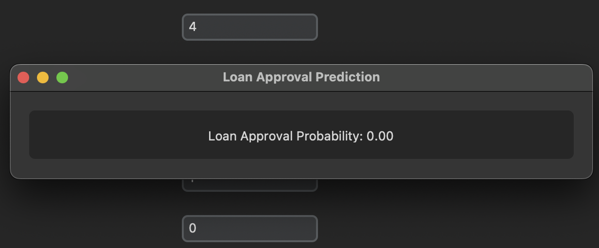

<h1 align="center">🌟 SBA Loan Underwriting System"  🌟</h1>

<p align="center">
  <a href="#context">Context</a> •
  <a href="#about">About</a> •
  <a href="#getting-started">Getting Started</a> •
  <a href="#usage">Usage</a> •
  <a href="#contributing">Contributing</a> •
  <a href="#license">License</a>
</p>

## 🚀 Context

The dataset is from the U.S. Small Business Administration (SBA)

The U.S. SBA was founded in 1953 on the principle of promoting and assisting small enterprises in the U.S. credit market (SBA Overview and History, US Small Business Administration (2015)). Small businesses have been a primary source of job creation in the United States; therefore, fostering small business formation and growth has social benefits by creating job opportunities and reducing unemployment.

There have been many success stories of start-ups receiving SBA loan guarantees such as FedEx and Apple Computer. However, there have also been stories of small businesses and/or start-ups that have defaulted on their SBA-guaranteed loans.

## 🚀 About

This project looks at over 899164 businesses that have an SBA loan. Each row is a specific business and every column some information about that business.
The goal is to create a Machine Learning Model that is able to have a high accuracy in predicting if a business is a safe investment.
  - Deliverable
    * Notebook views to follow work process and navigate decision-making process
    * Machine Learning Model
    * GUI to run model outputs


<details>
  <summary><b>📖 Table of Contents</b> (click to expand)</summary>
  <ul>
    <li><a href="#getting-started">Getting Started</a></li>
    <li><a href="#usage">Usage</a></li>
    <li><a href="#built-with">Built With</a></li>
    
    <li><a href="#Coming to an End">Acknowledgements</a></li>
  </ul>
</details>

## 📦 Getting Started

<details>
  <summary><b>Instructions for Getting Started</b> (click to expand)</summary>
  
  ### Prerequisites
  

  - Jupyter Notebook
  - Numpy
  - Pandas
  - re
  - seaborn
  - matplotlib
  - plotly
  - xgboost
  - tkinter
  - random forest
  - grid search
  
  
  ### Installation
  
  1. Clone the repository: 
     ```
     git clone [git@github.com:brandontnavarrete/SBA-Loan-Approval.git]
     ```
  2. Install the required packages: 
     ```
     !pip install custometkinter
     ```
     
  ### Usage
  
  #### Wrangle
  
  - Begin with Kaggle dataset. [https://www.kaggle.com/datasets/mirbektoktogaraev/should-this-loan-be-approved-or-denied]
  - Handle missing values
  - Drop Columns that aren't helpful or columns that would contain data leakage
  - Handle data types / date time for exploration
  
  Once I had a dataframe that look clean and managable, I saved it to a csv named ("explore.csv").
  
  
  #### Explore
  
  - Compared target variable count, there are more good standing accounts than charged off accounts.
  - Checked for difference between `target` accounts ( term length, franchise status,...).
  
  I recommend creating more pre-determined questions before exploration. I plan on taking this dataset to Tableau and PowerBi. I created a csv to go further in to modeling.
  
  #### Model
  
  - Create and X and y split, where X is your features you want to model on and y is your dependent feature.
  - Split the data appropriately. I chose train and test for cross validation.
  - Scale data appropriately. (StandardScaler*).
  - Grid_search helps fine tune a models performance.
  _ (Find Your Best Model With Your Best Features)
  
  I checked my feature importance to see what was helping or hurting model performance, handled each feature as needed.
  
  #### GUI
  
  - Create a function that can interact with tkinter frame. (.get)
  _ Run the model in the function.
  - Scale .get data and fit to model
  - Function creates a new tkinter frame to display result
  
  - Create the main interface
  -[I followed this youtube video for a quick guide. NeuralNine](https://youtu.be/iM3kjbbKHQU)
  
  
  ### Example
  
  * An empty application prompt for A loan officer
  
  
  * An application that holds information about an applicant
  

  * A response from the model. 0 = safe bet, 1 = likely to default
  


  
</details>

## 🎈 Usage

In a full devloped project and a better implemented GUI, A bank would use this model as an underlying evaluation to determine if an applicant is a safe investment. As a financial loan officer / advisor, this gives model gives them a new tool or safety net to keep a banks saftey score managed properly.

## ⚒️ Built With

- python
- jupyter notebook
- tkinter
- customertkinter


## 🙏 Coming to an End 

The goal of the project was accomplished! 
- the model has A 95% accuracy in determining wether or not a business, if given an SBA loan, will be likely to default.
- the gui created with tkinter looks promising to take to full  development.

